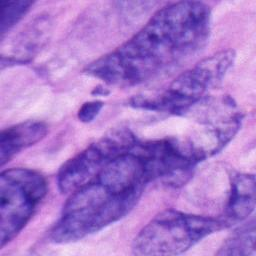
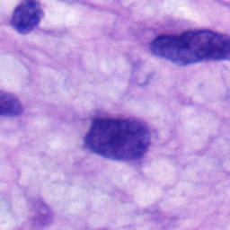
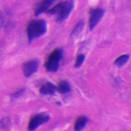
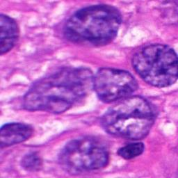

# DFSP-WSI

We are pleased to open-source a preview of **DFSP-WSI**, a whole-slide image (WSI) dataset for deep learning–based classification of spindle cell mesenchymal tumors of the skin.

### 📦 Partial Release  
This initial release includes **500 whole-slide images** across five diagnostic categories, with each class containing **100 slides**.

### 🔜 Full Dataset  
The complete dataset—including additional cases, annotations, and metadata—will be fully released upon publication of our associated manuscript.

> ⚠️ **Note**: Data access instructions and download links are provided separately. Please refer to the repository contents or contact the authors for access.

---

### 🖼️ Example Images by Class

| Class | Filename Path | Preview |
|-------|---------------|---------|
| **CD**  | `CD/_19-09867-43-44_RGB_Extended0_256_1black.jpg` |  |
| **FD**  | `FD/_18-19659_RGB_Extended0_256_1black.jpg` | |
| **MD**  | `MD/_18-11013-2_RGB_Extended0_256_1black.jpg` |  |
| **BFH** | `BFH/_18-03822_RGB_Extended0_256_1black.jpg` |  |
| **UPS** | `UPS/_16-14762_RGB_Extended5_256_1black.jpg` |  |

---
